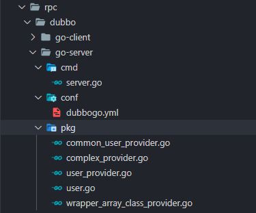

## Dubbo-go 源码笔记（一）Server 端开启服务过程

当拿到一款框架之后，一种不错的源码阅读方式大致如下：从运行最基础的 helloworld demo 源码开始 —> 再查看配置文件 —> 开启各种依赖服务（比如zk、consul） —> 开启服务端 —> 再到通过 client 调用服务端 —> 打印完整请求日志和回包。调用成功之后，再根据框架的设计模型，从配置文件解析开始，自顶向下递阅读整个框架的调用栈。

对于 C/S 模式的 rpc 请求来说，整个调用栈被拆成了 client 和 server 两部分，所以可以分别从 server 端的配置文件解析阅读到 server 端的监听启动，从 client 端的配置文件解析阅读到一次 invoker Call 调用。这样一次完整请求就明晰了起来。

dubbo-go 3.0默认支持Triple协议，本文讲解的是Dubbo协议的调用过程。

## 运行官网提供的 Dubbo协议 Demo

**官方 demo [相关链接](https://github.com/apache/dubbo-go-samples/tree/9e087bc3a0260a61f93c27c323d0aeebe4970bec)**，启动过程可以参考[HOWTO_ZH.md](https://github.com/apache/dubbo-go-samples/blob/9e087bc3a0260a61f93c27c323d0aeebe4970bec/HOWTO_zh.md)。

### 1. dubbo-go 3.0 版本 Dubbo协议 QuickStart

#### 1）下载demo

+ 将仓库 clone 到本地，切换到指定版本。

``` bash
$ git clone https://github.com/dubbogo/dubbo-samples.git
$ git branch hello 9e087bc3a0260a61f93c27c323d0aeebe4970bec && git checkout hello
```

#### 1）运行 zookeeper

+ 使用`docker`运行zookeeper注册中心，需要首先安装`docker`和`docker-compose`。

``` bash
make -f build/Makefile docker-up  
```

  当看到类似下面的输出信息时，就表明 zookeeper server 启动就绪了。

  ```bash
   >  Starting dependency services with ./integrate_test/dockercompose/docker-compose.yml
   Docker Compose is now in the Docker CLI, try `docker compose up`
   
   Creating network "dockercompose_default" with the default driver
   Creating dockercompose_zookeeper_1 ... done
   Creating etcd                      ... done
   Creating nacos-standalone          ... done
  ```

#### 2）开启一个 go-server 服务

- 进入 dubbo协议rpc调用的目录

```bash
$ cd rpc/dubbo
```

进入目录后可看到四个文件夹，分别支持 go 和 java 的 client 以及 server，我们尝试运行一个 go 的 server。进入 cmd 子文件夹内，可以看到里面保存了 go 文件。

```bash
$ cd go-server/cmd
```

- sample 文件结构

可以在 go-server 里面看到三个文件夹：cmd、conf、pkg。

其中 cmd 文件夹下保存 go 源码，使用框架开启服务以及注册传输协议，conf 文件夹下保存配置文件，pkg 文件夹下保存了rpc调用服务的具体实现。对于 dubbo-go 框架，配置文件非常重要，没有文件将导致服务无法启动。

- 设置指向配置文件的环境变量

由于 dubbo-go 框架依赖配置文件启动，让框架定位到配置文件的方式就是通过环境变量来找。对于 server 端必须配置的环境变量：DUBBO_GO_CONFIG_PATH指向服务端配置文件。

```bash
$ export DUBBO_GO_CONFIG_PATH="../conf/dubbogo.yml"
```

- 设置 go 代理并运行服务

```bash
$ go run .
```

如果提示 timeout，则需要设置 goproxy 代理。

```bash
$ export GOPROXY="http://goproxy.io"
```

再运行 go run 即可开启服务。

#### 3）运行 go-client 调用 server 服务

- 进入 go-client 的源码目录

```bash
$ cd rpc/dubbo/go-client/cmd
```

- 同理，在 /cmd 下配置环境变量

```bash
$ export DUBBO_GO_CONFIG_PATH="../conf/dubbogo.yml"
```

配置 go 代理：

```bash
$ export GOPROXY="http://goproxy.io"
````

- 运行程序

```bash
$ go run .
```

即可在日志中找到打印出的请求结果：

```bash
start to test dubbo
2022-05-09T09:58:42.040-0400    INFO    cmd/client.go:65        response result: User{ID:113, Name:Moorse, Age:30, Time:2022-05-09 09:57:44.216 -0400 EDT, Sex:WOMAN}
2022-05-09T09:58:42.041-0400    INFO    cmd/client.go:67

start to test dubbo - enum
2022-05-09T09:58:42.041-0400    INFO    cmd/client.go:72        response result: WOMAN
2022-05-09T09:58:42.041-0400    INFO    cmd/client.go:74

start to test dubbo - GetUser0
2022-05-09T09:58:42.041-0400    INFO    cmd/client.go:79        response result: User{ID:113, Name:Moorse, Age:30, Time:2022-05-09 09:57:44.216 -0400 EDT, Sex:WOMAN}
2022-05-09T09:58:42.041-0400    INFO    cmd/client.go:81

start to test dubbo - GetUsers
2022-05-09T09:58:42.042-0400    INFO    cmd/client.go:86        response result: [User{ID:002, Name:Lily, Age:20, Time:2022-05-09 09:57:44.216 -0400 EDT, Sex:WOMAN} User{ID:113, Name:Moorse, Age:30, Time:2022-05-09 09:57:44.216 -0400 EDT, Sex:WOMAN}]
2022-05-09T09:58:42.042-0400    INFO    cmd/client.go:88

start to test dubbo - getUser
2022-05-09T09:58:42.042-0400    INFO    cmd/client.go:95        response result: User{ID:1, Name:, Age:0, Time:0001-01-01 00:00:00 +0000 UTC, Sex:MAN}
2022-05-09T09:58:42.042-0400    INFO    cmd/client.go:97
```

同样，在运行的 server 中，也可以在日志中找到打印出的请求：

```bash
[2022-05-09/09:58:42 github.com/apache/dubbo-go-samples/rpc/dubbo/go-server/pkg.(*CommonUserProvider).GetUser: common_user_provider.go: 51] req:&pkg.User{ID:"003", Name:"", Age:0, Time:time.Date(1, time.January, 1, 0, 0, 0, 0, time.UTC), Sex:0}
[2022-05-09/09:58:42 github.com/apache/dubbo-go-samples/rpc/dubbo/go-server/pkg.(*CommonUserProvider).GetUser: common_user_provider.go: 54] rsp:&pkg.User{ID:"113", Name:"Moorse", Age:30, Time:time.Date(2022, time.May, 9, 9, 57, 44, 216299612, time.Local), Sex:1}
[2022-05-09/09:58:42 github.com/apache/dubbo-go-samples/rpc/dubbo/go-server/pkg.(*CommonUserProvider).GetUser0: common_user_provider.go: 62] id:003, name:Moorse
[2022-05-09/09:58:42 github.com/apache/dubbo-go-samples/rpc/dubbo/go-server/pkg.(*CommonUserProvider).GetUsers: common_user_provider.go: 93] req:[002 003]
[2022-05-09/09:58:42 github.com/apache/dubbo-go-samples/rpc/dubbo/go-server/pkg.(*CommonUserProvider).GetUsers: common_user_provider.go: 98] user:User{ID:002, Name:Lily, Age:20, Time:2022-05-09 09:57:44.216299537 -0400 EDT m=+0.041815627, Sex:WOMAN}
[2022-05-09/09:58:42 github.com/apache/dubbo-go-samples/rpc/dubbo/go-server/pkg.(*CommonUserProvider).GetUsers: common_user_provider.go: 103] user1:User{ID:113, Name:Moorse, Age:30, Time:2022-05-09 09:57:44.216299612 -0400 EDT m=+0.041815702, Sex:WOMAN}
[2022-05-09/09:58:42 github.com/apache/dubbo-go-samples/rpc/dubbo/go-server/pkg.(*CommonUserProvider).GetUser2: common_user_provider.go: 76] req:1
```

恭喜！一次基于 dubbo-go 的 rpc 调用成功。

#### 4）常见问题

- 当日志中出现 register 失败的情况，一般为向注册中心注册失败，检查注册中心是否开启，检查配置文件中关于 register 的端口是否正确。
- sample 的默认开启端口为 20000，确保启动前无占用。

### 2. 服务端源码

#### 1）目录结构

dubbo-go 框架的 example 提供的目录如下：



- cmd/ 保存 go 源码，使用框架开启服务以及注册传输协议
- pkg/ 文件夹下存放rpc调用服务的具体实现
- conf/ 文件夹下存放不同环境的配置文件

### 2）关键源码

源码放置在 cmd/和pkg/ 文件夹下，主要包含 server.go 和 user.go, user_provider.go等文件，顾名思义，server.go 用于使用框架开启服务以及注册传输协议；user.go和user_provider.go 则定义了 rpc-service 结构体，以及传输协议的结构。

- **user.go**

user.go定义了rpc调用过程中用户自定义的传输结构体。

```go
type (
	User struct {
		// !!! Cannot define lowercase names of variable
		ID   string `hessian:"id"`
		Name string
		Age  int32
		Time time.Time
		Sex  Gender // notice: java enum Object <--> go string
	}
)
```

+ **user_provieder.go**

user_provieder.go提供了rpc调用服务，UserProvider内嵌的CommonUserProvider实现了GetUser等一系列服务。

``` go
type UserProvider struct {
	CommonUserProvider
}
```

+ **server.go**

``` go
func main() {

	// ------for hessian2------
	hessian.RegisterJavaEnum(pkg.Gender(pkg.MAN))
	hessian.RegisterJavaEnum(pkg.Gender(pkg.WOMAN))
	hessian.RegisterPOJO(&pkg.User{})
	config.SetProviderService(&pkg.UserProvider{})
	config.SetProviderService(&pkg.UserProvider1{})
	config.SetProviderService(&pkg.UserProvider2{})
	config.SetProviderService(&pkg.ComplexProvider{})
	config.SetProviderService(&pkg.WrapperArrayClassProvider{})
	// ------------

	if err := config.Load(); err != nil {
		panic(err)
	}

	initSignal()
}
```

在 server.go 的主函数中，首先调用 hessian 接口注册传输结构体 User，从而可以在接下来使用 getty 打解包。之后调用 config 的 SetProviderService 函数，将当前 **rpc_service 注册在框架 config 上**。

**可以查看 dubbo 官方文档提供的设计图：**


service 层下面就是 config 层，用户服务会逐层向下注册，最终实现服务端的暴露。

之后调用 config.Load 函数，该函数位于框架 config/config_loader.go 内，这个函数是整个框架服务的启动点，**下面会详细讲这个函数内重要的配置处理过程**。执行完 Load() 函数之后，配置文件会读入框架，之后根据配置文件的内容，将注册的 service 实现到配置结构里，再调用 Export 暴露给特定的 registry，进而开启特定的 service 进行对应端口的 tcp 监听，成功启动并且暴露服务。

最终开启信号监听 initSignal() 优雅地结束一个服务的启动过程。

### 4. 客户端源码

客户端包含 client.go 和 user.go 两个文件，其中 user.go 与服务端基本一致。

+ **user.go**

user.go提供了rpc服务调用的对象，将该对象注册到dubbo框架上后，可以直接通过该对象调用rpc服务。

``` go
type UserProvider struct {
	GetUsers func(req []string) ([]*User, error)
	GetErr   func(ctx context.Context, req *User) (*User, error)

	GetUser func(ctx context.Context, req *User) (*User, error)

	GetUserNew func(ctx context.Context, req1, req2 *User) (*User, error)

	GetUser0  func(id string, name string) (User, error)
	GetUser2  func(ctx context.Context, req int32) (*User, error) `dubbo:"getUser"`
	GetUser3  func() error
	GetGender func(ctx context.Context, i int32) (Gender, error)
	Echo      func(ctx context.Context, req interface{}) (interface{}, error) // Echo represent EchoFilter will be used
}
```

- **client.go**

```go
var (
	userProvider = &pkg.UserProvider{}
)

// need to setup environment variable "DUBBO_GO_CONFIG_PATH" to "conf/dubbogo.yml" before run
func main() {
	hessian.RegisterJavaEnum(pkg.Gender(pkg.MAN))
	hessian.RegisterJavaEnum(pkg.Gender(pkg.WOMAN))
	hessian.RegisterPOJO(&pkg.User{})

	config.SetConsumerService(userProvider)

	err := config.Load()
	if err != nil {
		panic(err)
	}

	logger.Infof("\n\ntest")
	test()
}
```

main 函数和服务端也类似，首先将传输结构注册到 hessian 上，之后调用 config 的 SetConsumerService将该对象注册到dubbo框架上，再调用 config.Load() 函数。在下文会介绍，客户端和服务端会根据配置类型执行 config.Load() 中特定的函数 loadConsumerConfig() 和 loadProviderConfig()，从而达到“开启服务”、“调用服务”的目的。

加载完配置之后，还是通过实现服务、增加函数 proxy、申请 registry 和 reloadInvoker 指向服务端 ip 等操作，重写了客户端实例 userProvider 的对应函数，这时再通过调用 GetUser 函数，可以直接通过 invoker，调用到已经开启的服务端，实现 rpc 过程。

下面会从 server 端和 client 端两个角度，详细讲解服务启动、registry 注册和调用过程。

## Server 端

服务暴露过程涉及到多次原始 rpcService 的封装、暴露，网上其他文章的图感觉太过笼统，在此，简要地绘制了一个用户定义服务的数据流图，本文涉及的[源码仓库](https://github.com/apache/dubbo-go/tree/f481b16d363c52051aa53d04b9566eedfa676b7b)：


### 1. 加载配置

#### 1）框架初始化

在加载配置之前，框架提供了很多已定义好的协议、工厂等组件，都会在对应模块 init 函数内注册到 extension 模块上，以供接下来配置文件中进行选用。

其中重要的有：

- [**默认函数代理工厂**](https://github.com/apache/dubbo-go/blob/f481b16d363c52051aa53d04b9566eedfa676b7b/common/proxy/proxy_factory/default.go#L40)：common/proxy/proxy_factory/default.go

```go
func init() {
    extension.SetProxyFactory("default", NewDefaultProxyFactory)
}
```

它的作用是将原始 rpc-service 进行封装，形成 proxy_invoker，更易于实现远程 call 调用，详情可见其 invoke 函数。

- **[注册中心注册协议](https://github.com/apache/dubbo-go/blob/f481b16d363c52051aa53d04b9566eedfa676b7b/registry/protocol/protocol.go#L71)**：registry/protocol/protocol.go

```go
func init() {
    extension.SetProtocol("registry", GetProtocol)
}
```

它负责将 invoker 暴露给对应注册中心，比如 zk 注册中心。

- **[zookeeper注册协议](https://github.com/apache/dubbo-go/blob/f481b16d363c52051aa53d04b9566eedfa676b7b/registry/zookeeper/registry.go#L45)**：registry/zookeeper/zookeeper.go

```go
func init() {
    extension.SetRegistry("zookeeper", newZkRegistry)
}
```

它合并了 base_resiger，负责在服务暴露过程中，将服务注册在 zookeeper 注册器上，从而为调用者提供调用方法。

- **[dubbo传输协议](https://github.com/apache/dubbo-go/blob/f481b16d363c52051aa53d04b9566eedfa676b7b/protocol/dubbo/dubbo_protocol.go#L54)**：protocol/dubbo/dubbo_protocol.go

```go
func init() {
    extension.SetProtocol(DUBBO, GetProtocol)
}
```

它负责监听对应端口，将具体的服务暴露，并启动对应的事件 handler，将远程调用的 event 事件传递到 invoker 内部，调用本地 invoker 并获得执行结果返回。

- [**filter 包装调用链协议**](https://github.com/apache/dubbo-go/blob/f481b16d363c52051aa53d04b9566eedfa676b7b/protocol/protocolwrapper/protocol_filter_wrapper.go#L39)：protocol/protocolwrapper/protocol_filter_wrapper.go

```go
func init() {
    extension.SetProtocol(FILTER, GetProtocol)
}
```

它负责在服务暴露过程中，将代理 invoker 打包，通过配置好的 filter 形成调用链，并交付给 dubbo 协议进行暴露。

上述提前注册好的框架已实现的组件，在整个服务暴露调用链中都会用到，会根据配置取其所需。

#### 2）配置文件

服务端需要的重要配置有三个字段：services、protocols、registries。

[conf/dubbogo.yml](https://github.com/apache/dubbo-go-samples/blob/9e087bc3a0260a61f93c27c323d0aeebe4970bec/rpc/dubbo/go-server/conf/dubbogo.yml):

```yaml
# dubbo server yaml configure file
dubbo:
  registries:
    demoZK:
      protocol: zookeeper
      timeout: 3s
      address: 127.0.0.1:2181
  protocols:
    dubbo:
      name: dubbo
      port: 20000
  provider:
    services:
      UserProvider:
        interface: org.apache.dubbo.sample.UserProvider
      UserProvider1:
        interface: org.apache.dubbo.sample.UserProvider
        version: "2.0"
      UserProvider2:
        interface: org.apache.dubbo.sample.UserProvider
        version: "2.0"
        group: as
      ComplexProvider:
        interface: org.apache.dubbo.sample.ComplexProvider
      WrapperArrayClassProvider:
        interface: org.apache.dubbo.sample.WrapperArrayClassProvider
  logger:
    zap-config:
      level: info
```

其中 service 指定了要暴露的 rpc-service 名（"UserProvider）、暴露的协议名（"dubbo"）、注册的协议名("demoZk")、暴露的服务所处的 interface、负载均衡策略、集群失败策略及调用的方法等等。

其中，中间服务的协议名需要和 registries 下的 mapkey 对应，暴露的协议名需要和 protocols 下的 mapkey 对应。

可以看到上述例子中，使用了 dubbo 作为暴露协议，使用了 zookeeper 作为中间注册协议，并且给定了端口。如果 zk 需要设置用户名和密码，也可以在配置中写好。

#### 3）配置文件的读入和检查

> config/config_loader.go:: Load()

在上述 example 的 main 函数中，有 [config.Load()](https://github.com/apache/dubbo-go/blob/f481b16d363c52051aa53d04b9566eedfa676b7b/config/config_loader.go#L43) 函数的直接调用，该函数执行细节如下：

```go
var (
	rootConfig = NewRootConfigBuilder().Build()
)

func Load(opts ...LoaderConfOption) error {
	// conf
	conf := NewLoaderConf(opts...)
	if conf.rc == nil {
		koan := GetConfigResolver(conf)
		koan = conf.MergeConfig(koan)
		if err := koan.UnmarshalWithConf(rootConfig.Prefix(),
			rootConfig, koanf.UnmarshalConf{Tag: "yaml"}); err != nil {
			return err
		}
	} else {
		rootConfig = conf.rc
	}

	if err := rootConfig.Init(); err != nil {
		return err
	}
	return nil
}
```

之后在 rootConfig 中初始化所有的配置，rootConfig 相当于整个配置层级中的根节点。注释中也有提到 rootConfig 的是整个dubbo-go框架的开始，从此处导入本地的配置文件，其每个成员即为配置项中的一个选项。

``` go
// Init is to start dubbo-go framework, load local configuration, or read configuration from config-center if necessary.
// It's deprecated for user to call rootConfig.Init() manually, try config.Load(config.WithRootConfig(rootConfig)) instead.
func (rc *RootConfig) Init() error {
	// ...
    // 上面是一系列的初始化，初始化读取到的配置
    if err := rc.Provider.Init(rc); err != nil {
		return err
	}
	if err := rc.Consumer.Init(rc); err != nil {
		return err
	}
	if err := rc.Shutdown.Init(); err != nil {
		return err
	}
	rc.Start()
	return nil
}

func (rc *RootConfig) Start() {
	startOnce.Do(func() {
		gracefulShutdownInit()
		rc.Consumer.Load()
		rc.Provider.Load()
		exportMetadataService()
		registerServiceInstance()
	})
}
```

在本文中，我们重点关心服务端的初始化 rc.Provider.Init(rc) 和服务端的暴露 rc.Consumer.Load() 。

对于 provider 端，可以看到 rc.Provider.Init(rc) 函数代码如下，其主要负责的是配置的读入和检查：

``` go
for key, serviceConfig := range c.Services {
    if serviceConfig.Interface == "" {
        service := GetProviderService(key)
        // try to use interface name defined by pb
        supportPBPackagerNameSerivce, ok := service.(common.TriplePBService)
        if !ok {
            continue
        } else {
            // use interface name defined by pb
            serviceConfig.Interface = supportPBPackagerNameSerivce.XXX_InterfaceName()
        }
    }
    // 调用serviceConfig利用rootconfig配置相关信息
    if err := serviceConfig.Init(rc); err != nil {
        return err
    }

    serviceConfig.adaptiveService = c.AdaptiveService
}
```

之后利用 rc.Start() 调用 rc.Provider.Load()，逐步开始服务的暴露：

``` go
func (c *ProviderConfig) Load() {
	for key, svs := range c.Services {
		rpcService := GetProviderService(key)
		if rpcService == nil {
			logger.Warnf("Service reference key %s does not exist, please check if this key "+
				"matches your provider struct type name, or matches the returned valued of your provider struct's Reference() function."+
				"View https://www.yuque.com/u772707/eqpff0/pqfgz3#zxdw0 for details", key)
			continue
		}
		svs.id = key
		svs.Implement(rpcService)
		if err := svs.Export(); err != nil {
			logger.Errorf(fmt.Sprintf("service %s export failed! err: %#v", key, err))
		}
	}

}
```

前面提到，在配置文件中已经写好了要暴露的 service 的种种信息，比如服务名、interface 名、method 名等等。在图中 for 循环内，会将所有 service 的服务依次实现。

for 循环的第一行，根据 key 调用 GetProviderService 函数，拿到注册的 rpcService 实例，这里对应上述提到的 server.go 主函数中，用户手动注册的自己实现的 rpc-service 实例：

``` go
config.SetProviderService(&pkg.UserProvider{})
config.SetProviderService(&pkg.UserProvider1{})
config.SetProviderService(&pkg.UserProvider2{})
config.SetProviderService(&pkg.ComplexProvider{})
config.SetProviderService(&pkg.WrapperArrayClassProvider{})
```

进入到 [SetProviderService](https://github.com/apache/dubbo-go/blob/f481b16d363c52051aa53d04b9566eedfa676b7b/config/service.go#L35) 函数中，可以发现其只是设置了 proServices 这个全局变量，只是一个通过哈希表将服务名（string）指向服务具体调用的对象（interface{}），[GetProviderService](https://github.com/apache/dubbo-go/blob/f481b16d363c52051aa53d04b9566eedfa676b7b/config/service.go#L66) 也是从 proServices 该全局变量读取相应的对象。将这个对象通过Implement 函数写到 sys（[ServiceConfig](https://github.com/apache/dubbo-go/blob/f481b16d363c52051aa53d04b9566eedfa676b7b/config/service_config.go#L51) 类型）上，设置好 sys 的 key 和协议组，最终调用了 sys 的 Export 方法。

此处对应流程图的部分：


至此，框架配置结构体已经拿到了所有 service 有关的配置，以及用户定义好的 rpc-service 实例，它触发了 Export 方法，旨在将自己的实例暴露出去。这是 Export 调用链的起始点。

### 2. 原始 service 封装入 proxy_invoker

> config/service_config.go :: Export()

接下来进入 [ServiceConfig.Export()](https://github.com/apache/dubbo-go/blob/f481b16d363c52051aa53d04b9566eedfa676b7b/config/service_config.go#L213) 函数.

这个函数进行了一些细碎的操作，比如为不同的协议分配随机端口，如果指定了多个中心注册协议，则会将服务通过多个中心注册协议的 registryProtocol 暴露出去，我们只关心对于一个注册协议是如何操作的。还有一些操作比如生成调用 url 和注册 url，用于为暴露做准备。

#### 1）首先通过配置生成对应 registryUrl 和 serviceUrl

``` go
regUrls := loadRegistries(s.RegistryIDs, s.RCRegistriesMap, common.PROVIDER)
```

registryUrl 是用来向中心注册组件发起注册请求的，对于 zookeeper 的话，会传入其 ip 和端口号，以及附加的用户名密码等信息。

这个 regUrl 目前只存有注册（zk）相关信息，后续会补写入 ServiceIvk，即服务调用相关信息，里面包含了方法名，参数等...

#### 2）对于一个注册协议，将传入的 rpc-service 实例注册在 common.ServiceMap

``` cpp
methods, err := common.ServiceMap.Register(s.Interface, proto.Name, s.Group, s.Version, s.rpcService)
```

这个 Register 函数将服务实例注册了两次，一次是以 Interface 为 key 写入接口服务组内，一次是以 interface 和 proto 为 key 写入特定的一个唯一的服务。

后续服务调用过程将会从 **[common.Map](https://github.com/apache/dubbo-go/blob/f481b16d363c52051aa53d04b9566eedfa676b7b/common/rpc_service.go#L223)** 里面取出来这个实例。

#### 3）获取默认代理工厂，将实例封装入代理 invoker

```go
// ivkURL封装了上面注册到common.Map中服务的方法名methods
ivkURL := common.NewURLWithOptions(
			common.WithPath(s.Interface),
			common.WithProtocol(proto.Name),
			common.WithIp(proto.Ip),
			common.WithPort(port),
			common.WithParams(urlMap),
			common.WithParamsValue(constant.BeanNameKey, s.id),
			//common.WithParamsValue(constant.SslEnabledKey, strconv.FormatBool(config.GetSslEnabled())),
			common.WithMethods(strings.Split(methods, ",")),
			common.WithToken(s.Token),
			common.WithParamsValue(constant.MetadataTypeKey, s.metadataType),
		)
// 拿到一个proxyInvoker，这个invoker的url是传入的regUrl，这个地方将上面注册的service实例封装成了invoker
// 这个GetProxyFactory返回的默认是common/proxy/proxy_factory/default.go
// 这个默认工厂调用GetInvoker获得默认的proxyInvoker，保存了当前注册regUrl
setRegistrySubURL(ivkURL, regUrl)
invoker := proxyFactory.GetInvoker(regUrl)

// 暴露出来 生成exporter,开启tcp监听
// 这里就该跳到registry/protocol/protocol.go registryProtocol 调用的Export，将当前proxyInvoker导出
exporter := s.cacheProtocol.Export(invoker)
```

这一步的 `proxyFactory := extension.GetProxyFactory(s.ProxyFactoryKey)` 方法获取默认代理工厂，通过传入上述构造的 regUrl，将 url 封装入代理 invoker。

可以进入 [common/proxy/proxy_factory/default.go::ProxyInvoker.Invoke()](https://github.com/apache/dubbo-go/blob/f481b16d363c52051aa53d04b9566eedfa676b7b/common/proxy/proxy_factory/default.go#L86 ) 函数里，看到对于 common.Map 取用为 svc 的部分，以及关于 svc 对应 Method 的实际调用 Call 的函数如下：

``` go
// get method
line 107: method := svc.Method()[methodName]
		  ...
// call method
line 145: returnValues := method.Method().Func.Call(in)
```

到这里，上面 GetInvoker(*regUrl) 返回的 invoker 即为 proxy_invoker，它封装好了用户定义的 rpc_service，并将具体的调用逻辑封装入了 Invoke 函数内。

> 为什么使用 Proxy_invoker 来调用？
>
> 通过这个 proxy_invoke 调用用户的功能函数，调用方式将更加抽象化，可以在代码中看到，通过 ins 和 outs 来定义入参和出参，将整个调用逻辑抽象化为 invocation 结构体，而将具体的函数名的选择、参数向下传递和 reflect 反射过程封装在 invoke 函数内，这样的设计更有利于之后远程调用。个人认为这是 dubbo Invoke 调用链的设计思想。
>
> 至此，实现了图中对应的部分：


### 3. registry 协议在 zkRegistry 上暴露上面的 proxy_invoker

上面，我们执行到了 [exporter = c.cacheProtocol.Export(invoker)](https://github.com/apache/dubbo-go/blob/f481b16d363c52051aa53d04b9566eedfa676b7b/config/service_config.go#L285)。

这里的 cacheProtocol 为一层缓存设计，对应到原始的 demo 上，这里是默认实现好的 registryProtocol。

> [registry/protocol/protocol.go:: Export()](https://github.com/apache/dubbo-go/blob/f481b16d363c52051aa53d04b9566eedfa676b7b/registry/protocol/protocol.go#L175)

这个函数内构造了多个 EventListener，非常有 java 的设计感。

我们只关心服务暴露的过程，先忽略这些监听器。

#### 1）获取注册 url 和服务 url

``` go
registryUrl := getRegistryUrl(originInvoker)
providerUrl := getProviderUrl(originInvoker)
```

#### 2）proxy_invoker 封装入 wrapped_invoker，得到 filter 调用链，本地暴露服务。

[`exporter := proto.doLocalExport(originInvoker, providerUrl)`](https://github.com/apache/dubbo-go/blob/f481b16d363c52051aa53d04b9566eedfa676b7b/registry/protocol/protocol.go#L192)，首先得到filter 调用链，并且在本地暴露，防止出现注册中心已经准备好服务，但是本地服务无法调用的情况。

```go
func (proto *registryProtocol) doLocalExport(originInvoker protocol.Invoker, providerUrl *common.URL) *exporterChangeableWrapper {
	key := getCacheKey(originInvoker)
	cachedExporter, loaded := proto.bounds.Load(key)
	if !loaded {
		// new Exporter
		invokerDelegate := newInvokerDelegate(originInvoker, providerUrl)
        // 调用protocolwrapper.FILTER协议的export方法
		cachedExporter = newExporterChangeableWrapper(originInvoker,
			extension.GetProtocol(protocolwrapper.FILTER).Export(invokerDelegate))
		proto.bounds.Store(key, cachedExporter)
	}
	return cachedExporter.(*exporterChangeableWrapper)
}
```

新建一个 WrappedInvoker，用于之后链式调用。

拿到提前实现并注册好的 ProtocolFilterWrapper，调用 Export 方法，进一步暴露。

> [protocol/protocolwrapped/protocol_filter_wrapper.go:Export()](https://github.com/apache/dubbo-go/blob/f481b16d363c52051aa53d04b9566eedfa676b7b/protocol/protocolwrapper/protocol_filter_wrapper.go#L50)

``` go
// Export service for remote invocation
func (pfw *ProtocolFilterWrapper) Export(invoker protocol.Invoker) protocol.Exporter {
	if pfw.protocol == nil {
		pfw.protocol = extension.GetProtocol(invoker.GetURL().Protocol)
	}
	invoker = BuildInvokerChain(invoker, constant.ServiceFilterKey)
	return pfw.protocol.Export(invoker)
}
```

> [protocol/protocolwrapped/protocol_filter_wrapper.go:buildInvokerChain](https://github.com/apache/dubbo-go/blob/f481b16d363c52051aa53d04b9566eedfa676b7b/protocol/protocolwrapper/protocol_filter_wrapper.go#L75)

``` go
for i := len(filterNames) - 1; i >= 0; i-- {
    flt, _ := extension.GetFilter(strings.TrimSpace(filterNames[i]))
    fi := &FilterInvoker{next: next, invoker: invoker, filter: flt}
    next = fi
}
```

可见，根据配置的内容，通过链式调用的构造，将 proxy_invoker 层层包裹在调用链的最底部，最终返回一个调用链 invoker。

对应图中部分：


至此，我们已经拿到 filter 调用链，期待将这个 chain 暴露到特定端口，用于相应请求事件。

#### 3）通过 dubbo 协议暴露 wrapped_invoker

> [protocol/protocolwrapped/protocol_filter_wrapper.go:Export()](https://github.com/apache/dubbo-go/blob/f481b16d363c52051aa53d04b9566eedfa676b7b/protocol/protocolwrapper/protocol_filter_wrapper.go#L55)

```go
// 通过dubbo协议Export  dubbo_protocol调用的 export_2
return pfw.protocol.Export(invoker)
```

回到上述 Export 函数的最后一行，调用了 dubboProtocol 的 Export 方法，将上述 chain 真正暴露。

该 Export 方法的具体实现在：[protocol/dubbo/dubbo_protocol.go: Export()](https://github.com/apache/dubbo-go/blob/f481b16d363c52051aa53d04b9566eedfa676b7b/protocol/dubbo/dubbo_protocol.go#L78)。

``` go
// Export export dubbo service.
// 返回一个Exporter，包含了invoker，并且在serverMap中开启了监听的tcpserver
func (dp *DubboProtocol) Export(invoker protocol.Invoker) protocol.Exporter {
	url := invoker.GetURL()
	serviceKey := url.ServiceKey()
	exporter := NewDubboExporter(serviceKey, invoker, dp.ExporterMap())
    // 将封装了invoker的exporter注册到exporterMap中
	dp.SetExporterMap(serviceKey, exporter)
	logger.Infof("[DUBBO Protocol] Export service: %s", url.String())
	// start server
    // 开启一个基于getty的tcp server, 放到了当前DubboProtocol.serverMap
    // 在事件监听器的handler中取出exporter使用。
	dp.openServer(url)
	return exporter
}
```

这一函数做了两个事情：构造触发器、启动服务。

- 将传入的 Invoker 调用 chain 进一步封装，封装成一个 exporter，再将这个 export 放入 map 保存。**注意！这里把 exporter 放入了 [exporterMap](https://github.com/apache/dubbo-go/blob/f481b16d363c52051aa53d04b9566eedfa676b7b/protocol/dubbo/dubbo_protocol.go#L62) 中，在下面服务启动的时候，会以注册事件监听器的形式将这个 exporter 取出！**
- 调用 dubboProtocol 的 [openServer](https://github.com/apache/dubbo-go/blob/f481b16d363c52051aa53d04b9566eedfa676b7b/protocol/dubbo/dubbo_protocol.go#L115) 方法，开启一个针对特定端口的监听。

``` go
func (dp *DubboProtocol) openServer(url *common.URL) {
	_, ok := dp.serverMap[url.Location]
	if !ok {
		_, ok := dp.ExporterMap().Load(url.ServiceKey())
		if !ok {
			panic("[DubboProtocol]" + url.Key() + "is not existing")
		}

		dp.serverLock.Lock()
		_, ok = dp.serverMap[url.Location]
		if !ok {
			handler := func(invocation *invocation.RPCInvocation) protocol.RPCResult {
				return doHandleRequest(invocation)
			}
            // handler对请求进行处理
			srv := remoting.NewExchangeServer(url, getty.NewServer(url, handler))
			dp.serverMap[url.Location] = srv
			srv.Start()
		}
		dp.serverLock.Unlock()
	}
}

```

如上图所示，一个 Session 被传入，开启对应端口的事件监听。

至此构造出了 exporter，完成图中部分：


#### 4）获取注册中心实例 zkRegistry

``` go
// url to registry
reg := proto.getRegistry(registryUrl)

// 一层缓存操作，如果 cache 没有需要从 common 里面重新拿 zkRegistry。
func (proto *registryProtocol) getRegistry(registryUrl *common.URL) registry.Registry {
	var err error
	reg, loaded := proto.registries.Load(registryUrl.Location)
	if !loaded {
		reg, err = extension.GetRegistry(registryUrl.Protocol, registryUrl)
		if err != nil {
			logger.Errorf("Registry can not connect success, program is going to panic.Error message is %s", err.Error())
			panic(err)
		}
		proto.registries.Store(registryUrl.Location, reg)
	}
	return reg.(registry.Registry)
}
```

#### 5）zkRegistry 调用 Registry 方法，在 zookeeper 上注册 dubboPath

上述拿到了具体的 zkRegistry 实例，该实例的定义在：[registry/zookeeper/registry.go](https://github.com/apache/dubbo-go/blob/f481b16d363c52051aa53d04b9566eedfa676b7b/registry/zookeeper/registry.go)。

``` go
type zkRegistry struct {
	registry.BaseRegistry
	client       *gxzookeeper.ZookeeperClient
	listenerLock sync.Mutex
	listener     *zookeeper.ZkEventListener
	dataListener *RegistryDataListener
	cltLock      sync.Mutex
	// for provider
	zkPath map[string]int // key = protocol://ip:port/interface
}
```

该结构体组合了 registry.BaseRegistry 结构，base 结构定义了注册器基础的功能函数，比如 Registry、Subscribe 等，但在这些默认定义的函数内部，还是会调用 facade 层（zkRegistry 层）的具体实现函数，这一设计模型能在保证已有功能函数不需要重复定义的同时，引入外层函数的实现，类似于结构体继承却又复用了代码。这一设计模式值得学习。

我们查看上述 [registry/protocol/protocol.go:: Export()](https://github.com/apache/dubbo-go/blob/f481b16d363c52051aa53d04b9566eedfa676b7b/registry/protocol/protocol.go#L175) 函数，直接调用了:

```go
// 1. 通过zk注册器，调用Register()函数，将已有@root@rawurl注册到zk上
    err := reg.Register(registeredProviderUrl)
```

将已有 RegistryUrl 注册到了 zkRegistry 上。

这一步调用了 baseRegistry 的 Register 函数，进而调用 zkRegister 的 DoRegister 函数，进而调用[registerTempZookeeperNode](https://github.com/apache/dubbo-go/blob/f481b16d363c52051aa53d04b9566eedfa676b7b/registry/zookeeper/registry.go#L161)。

``` go
// DoRegister actually do the register job in the registry center of zookeeper
func (r *zkRegistry) DoRegister(root string, node string) error {
	return r.registerTempZookeeperNode(root, node)
}
```

在这个函数里，将对应 root 创造一个新的节点。

``` go
zkPath, err = r.client.RegisterTemp(root, node)
```

并且写入具体 node 信息，node 为 url 经过 encode 的结果，**包含了服务端的调用方式。**

这部分的代码较为复杂，具体可以看 baseRegistry 的 [processURL() 函数](https://github.com/apache/dubbo-go/blob/f481b16d363c52051aa53d04b9566eedfa676b7b/registry/base_registry.go#L215)。

至此，将服务端调用 url 注册到了 zookeeper 上，而客户端如果想获取到这个 url，只需要传入特定的 dubboPath，向 zk 请求即可。目前 client 是可以获取到访问方式了，但服务端的特定服务还没有启动，还没有开启特定协议端口的监听，这也是 registry/protocol/protocol.go:: Export() 函数接下来要做的事情。

### 4. 注册触发动作

上述只是启动了服务，但还没有看到触发事件的细节，dubbo 协议使用getty框架进行rpc通信，关于getty的快速入门可以通过https://zhuanlan.zhihu.com/p/413507181 快速了解。点进上面的 s.newSession 可以看到，dubbo 协议为一个 [getty 的 session](https://github.com/apache/dubbo-go/blob/f481b16d363c52051aa53d04b9566eedfa676b7b/remoting/getty/getty_server.go#L134) 默认使用了如下配置，注意这里设置了[getty对包的编解码方式](https://github.com/apache/dubbo-go/blob/f481b16d363c52051aa53d04b9566eedfa676b7b/remoting/getty/getty_server.go#L148)。

``` go
// NewServer create a new Server
func (s *Server) newSession(session getty.Session) error {
	var (
		ok      bool
		tcpConn *net.TCPConn
		err     error
	)
	conf := s.conf

	if conf.GettySessionParam.CompressEncoding {
		session.SetCompressType(getty.CompressZip)
	}
	if _, ok = session.Conn().(*tls.Conn); ok {
		session.SetName(conf.GettySessionParam.SessionName)
		session.SetMaxMsgLen(conf.GettySessionParam.MaxMsgLen)
        // 设置编解码的方式
		session.SetPkgHandler(NewRpcServerPackageHandler(s))
		session.SetEventListener(s.rpcHandler)
		session.SetReadTimeout(conf.GettySessionParam.tcpReadTimeout)
		session.SetWriteTimeout(conf.GettySessionParam.tcpWriteTimeout)
		session.SetCronPeriod((int)(conf.heartbeatPeriod.Nanoseconds() / 1e6))
		session.SetWaitTime(conf.GettySessionParam.waitTimeout)
		logger.Debugf("server accepts new session:%s\n", session.Stat())
		return nil
	}
	...
	return nil
}
```

开启服务也就是启动了新的[EventLoop](https://github.com/apache/dubbo-go/blob/f481b16d363c52051aa53d04b9566eedfa676b7b/remoting/getty/getty_server.go#L197)。

``` go
// Start dubbo server.
func (s *Server) Start() {
	var (
		addr      string
		tcpServer getty.Server
	)

	addr = s.addr
	serverOpts := []getty.ServerOption{getty.WithLocalAddress(addr)}
	if s.conf.SSLEnabled {
		serverOpts = append(serverOpts, getty.WithServerSslEnabled(s.conf.SSLEnabled),
			getty.WithServerTlsConfigBuilder(config.GetServerTlsConfigBuilder()))
	}

	serverOpts = append(serverOpts, getty.WithServerTaskPool(gxsync.NewTaskPoolSimple(s.conf.GrPoolSize)))

	tcpServer = getty.NewTCPServer(serverOpts...)
	tcpServer.RunEventLoop(s.newSession)
	logger.Debugf("s bind addr{%s} ok!", s.addr)
	s.tcpServer = tcpServer
}
```

其中很重要的一个配置是 EventListener，传入的是 dubboServer 的默认 rpcHandler。

> [protocol/dubbo/listener.go:OnMessage()](https://github.com/apache/dubbo-go/blob/f481b16d363c52051aa53d04b9566eedfa676b7b/remoting/getty/listener.go#L238)，[protocol/dubbo/readwriter.go](https://github.com/apache/dubbo-go/blob/f481b16d363c52051aa53d04b9566eedfa676b7b/remoting/getty/readwriter.go#L103)

rpcHandler 有一个实现好的 OnMessage 函数实现消息收发的逻辑，Write\Read实现了对原始信息的编解码。根据 getty 的 API，当 client 调用该端口时，会首先通过Write\Read对二进制流进行编解码，之后触发 OnMessage进行逻辑处理。

这一函数实现了在 getty session 接收到 rpc 调用后的一系列处理：

- 传入包的解析

``` go
// Read data from client. if the package size from client is larger than 4096 byte, client will read 4096 byte
// and send to client each time. the Read can assemble it.
func (p *RpcServerPackageHandler) Read(ss getty.Session, data []byte) (interface{}, int, error) {
	req, length, err := (p.server.codec).Decode(data)
	// resp,len, err := (*p.).DecodeResponse(buf)
	if err != nil {
		if errors.Is(err, hessian.ErrHeaderNotEnough) || errors.Is(err, hessian.ErrBodyNotEnough) {
			return nil, 0, nil
		}

		logger.Errorf("pkg.Unmarshal(ss:%+v, len(@data):%d) = error:%+v", ss, len(data), err)

		return nil, 0, err
	}

	return req, length, err
}
```

- 拿到解码后传入的参数，使用[requestHandler](https://github.com/apache/dubbo-go/blob/f481b16d363c52051aa53d04b9566eedfa676b7b/remoting/getty/listener.go#L307)进行调用。

``` go
invoc, ok := req.Data.(*invocation.RPCInvocation)
if !ok {
    panic("create invocation occur some exception for the type is not suitable one.")
}
attachments := invoc.Attachments()
attachments[constant.LocalAddr] = session.LocalAddr()
attachments[constant.RemoteAddr] = session.RemoteAddr()

result := h.server.requestHandler(invoc)
```

- [handler]((https://github.com/apache/dubbo-go/blob/f481b16d363c52051aa53d04b9566eedfa676b7b/protocol/dubbo/dubbo_protocol.go#L126)是封装了[doHandleRequest])是包装了doHandleRequest的匿名函数，在[doHandleRequest](https://github.com/apache/dubbo-go/blob/f481b16d363c52051aa53d04b9566eedfa676b7b/protocol/dubbo/dubbo_protocol.go#L145)中先拿到exporter，之后拿到对应的 Invoker，执行调用，返回调用结果。

``` go
func doHandleRequest(rpcInvocation *invocation.RPCInvocation) protocol.RPCResult {
	// 拿到exporter
	exporter, _ := dubboProtocol.ExporterMap().Load(rpcInvocation.ServiceKey())
	result := protocol.RPCResult{}
	...
	// 拿到对应的 Invoker
	invoker := exporter.(protocol.Exporter).GetInvoker()
	// 执行调用
	invokeResult := invoker.Invoke(ctx, rpcInvocation)
	...
	// 返回调用结果
	return result
}
```

整个被调过程一气呵成。实现了从 getty.Session 的调用事件，到经过层层封装的 invoker 的调用。

至此，一次 rpc 调用得以正确返回。

## 小结

- **关于 Invoker 的层层封装**

能把一次调用抽象成一次 invoke；能把一个协议抽象成针对 invoke 的封装；能把针对一次 invoke 所做出的特定改变封装到 invoke 函数内部，可以降低模块之间的耦合性。层层封装逻辑更加清晰。

- **关于 URL 的抽象**

关于 dubbo 的统一化请求对象 URL 的极度抽象是之前没有见过的... 个人认为这样封装能保证请求参数列表的简化和一致。但在开发的过程中，滥用极度抽象的接口可能造成... debug 的困难？以及不知道哪些字段是当前已经封装好的，哪些字段是无用的。

- **关于协议的理解**

之前理解的协议还是太过具体化了，而关于 dubbo-go 对于 dubboProtocol 的协议，我认为是基于 getty 的进一步封装，它定义了客户端和服务端，对于 getty 的 session 应该有哪些特定的操作，从而保证主调和被调的协议一致性，而这种保证也是一种协议的体现，是由 dubbo 协议来规范的。

如果你有任何疑问，欢迎钉钉扫码加入交流群：钉钉群号 23331795！

> 作者简介 **李志信** (GitHubID LaurenceLiZhixin)，中山大学软件工程专业在校学生，擅长使用 Java/Go 语言，专注于云原生和微服务等技术方向
