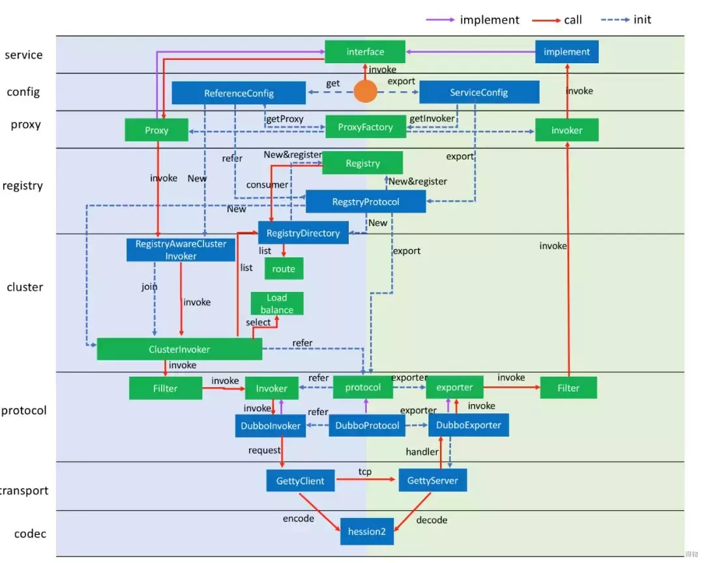
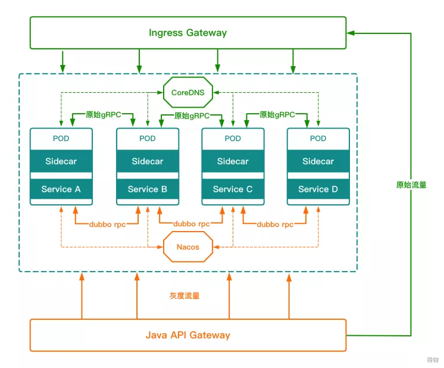
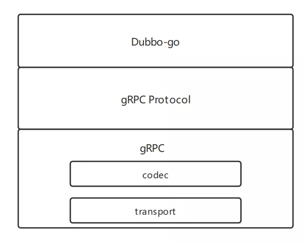
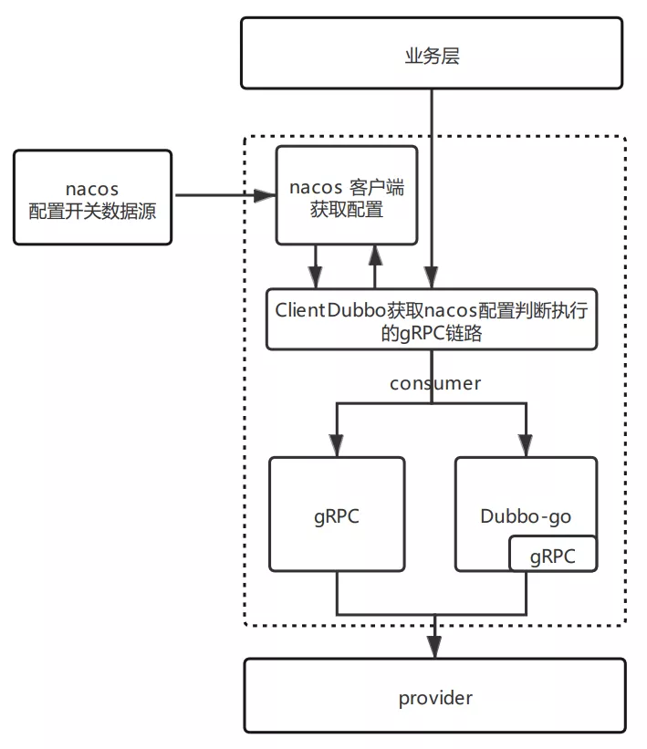
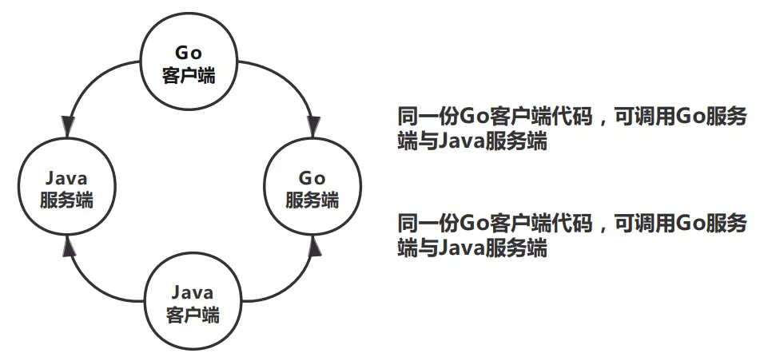

# 得物社区服务基于 dubbogo 技术升级实践


## 背景

2021 年是我司着重关注生产稳定性的一年，得物社区服务早期是由 PHP 语言构建的单体应用支撑着日活百万用户，随着高速的发展在性能跟业务上已逐渐不能满足未来的需求与规划，在第一阶段上社区与架构团队同学提供了php + yaf、Java + spring cloud、Go + grpc + K8S的技术选型方案，考虑到服务性能与迁移成本，最终选择了 Go + grpc + K8S 作为此项工程的首选为社区微服务构建建立起了里程碑。

随着业务的发展，对稳定性要求越来越高，为增强业务服务的自治能力，提高集群的稳定性与可控性，且考虑最低成本的接入方式，同时考虑社区与交易系统（Dubbo 技术栈）有着千丝万缕的关系，最终希望能完成两个集群系统的轻松融合，故选用应用层框架 Dubbo-go 来实 Golang 服务的注册与发现。

Golang 微服务架构，大家可能比较熟悉的是 Go Micro 和 Go Kit（还有 Gizmo），确实，Go Micro 的社区活跃度，Go Kit的GitHub Star 数也 18k 以上，但这里并没选择，主要是 Go Micro 提供了许多的功能，开箱即用，但灵活性受限；go Kit 虽被追捧，但是我们并非是重新起 Golang 服务，应用层框架限制过于严格，代码迁移成本将会非常高。

考虑以上困难，最终选了一个还在成长期的 Dubbo-go。

## Dubbo-go介绍

Dubbo-go 是目前 Dubbo 多语言生态最火热的项目之一，已随着Dubbo 生态加入 Apache 基金会，截止目前已有不少一二线互联网公司使用（钉钉、携程、涂鸦、开课吧等），社区活跃度较高，响应开发者需求较快，有较快且贴合开发着需求的版本迭代速度。



Dubbo-go 主项目，主要是基于 Dubbo 的分层代码设计，上图是Dubbo-go 的代码分层，基本上与 Java 版本 Dubbo 现有的分层一致，所以 Dubbo-go 也继承了 Dubbo 的一些优良特性，比如整洁的代码架构、易于扩展、完善的服务治理功能。

目前 Dubbo-go 已经实现了 Dubbo 的常用功能（如负责均衡、集群策略、服务多版本多实现、服务多注册中心多协议发布、泛化调用、服务降级熔断等），其中服务注册发现已经支持 zookeeper/etcd/consul/nacos 主流注册中心。这里不展开详细介绍。

## 方案实现

根据现有项目以 gRPC 为服务调用的背景前提下，考虑到对业务代码侵入程度，且做到兼容原有方案正常使用，两套 gRPC 实现下可切换自由，做到生产环境切换 RPC 治理框架的实时性与可控性，降低生产环境风险，故结合 Dubbo-go 自身支持 gRPC 协议入手满足以上需求。

注册中心选型为 Nacos，与目前现有中间件保持统一，同时满足配置部分配置项需求。



这里我们要先思考两个问题，一个是 Dubbo-go 的集成如何兼容原有gRPC 方案，保持两套方案可同时在线支持生产，第二个问题是两套 gRPC之间如何实现实时切换。

## 兼容性

在实现此项需求前，我们先来谈谈 gRPC 自身特性，gRPC 是谷歌开源的一个 RPC 框架，面向移动和 HTTP/2 设计，内容交换格式采用 ProtoBuf（Google Protocol Buffers），开源已久，提供了一种灵活、高效、自动序列化结构数据的机制，作用与 XML、Json 类似，但使用二进制，（反）序列化速度快，压缩效率高，传输协议采用 HTTP/2，性能比http1.1 提升很多。

在根据介绍的 gRPC 的相关特性可以看出来，gRPC 已经解决了codec 和 transport 两层的问题，结合 图1 看，从 cluster 层往上，是没有 gRPC 相关涉及的地方，从 图1 里面可以看出要做 gRPC 相关适配，在 protocol 这一层是最合适的，我们可以如同 DubboProtocol 一样，扩展出来一个 gRPCProtocol，这个 gRPC protocol 大体上相当于一个 Adapter，将底层的 gRPC 的实现和我们自身的 Dubbo-go 结合在一起。



基于上述，Dubbo-go 帮助我们解决了 gRPC 的相关整合，相当于在gRPC 基础之上包装了 Dubbo-go 治理层，而我们从 gRPC 的 ProtoBuf 修改作为切入点开始，Dubbo-go 官方基于 Google protobuf 扩展插件定义了Dubbo-go gRPC 所使用的 protobuf 自定义逻辑代码，完成兼容性问题即可。

```go
// HelloWorldServiceClientImpl is the client API for HelloWorldService service.
type HelloWorldServiceClientImpl struct {
  SayHello func(ctx context.Context, in *SayHelloReq, out *SayHelloResp) error
  //...
}

// service Reference
func (c *HelloWorldServiceClientImpl) Reference() string {
  return "helloWorldServiceImpl"
}

// GetDubboStub
func (c *HelloWorldServiceClientImpl) GetDubboStub(cc *grpc.ClientConn) HelloWorldServiceClient {
  return NewHelloWorldServiceClient(cc)
}

// Server interface
type HelloWorldServiceProviderBase struct {
  proxyImpl protocol.Invoker
}

// set invoker proxy
func (s *HelloWorldServiceProviderBase) SetProxyImpl(impl protocol.Invoker) {
  s.proxyImpl = impl
}

// get invoker proxy
func (s *HelloWorldServiceProviderBase) GetProxyImpl() protocol.Invoker {
  return s.proxyImpl
}
```

## 实时切换开关

实时切换，起初是为了在压测环境方便两套不同实现的 gRPC 方案可实时切换做压测数据收集，后期是抱着敬畏生产的态度，在生产环境刚接入Dubbo-go 时将 RPC 框架切换支持服务、方法自由切换，从稳定性出发，选择性的切换观测服务稳定性状态。

此项需求的接入，同样是从 gRPC 的 ProtoBuf 修改作为切入点开始，同时基于 Nacos 配置中心实现，我们将原有 gRPC 的客户端调用和Dubbo-go 的客户端调用封装成一个统一实例化入口（这里简称 ClinetDubbo），客户端所有方法新增一份继承 ClinetDubbo 具体实现（由protobuf 扩展插件统一脚本生成），实现内容大致为获取 ClinetDubbo中的两套 gRPC 客户端，此时通过 Nacos 配置获取配置中心所打开的客户端是哪一套，根据判断实现走具体的 gRPC 链路。



```go
// ClientDubbo
type HelloWorldServiceClientDubbo struct {
  GrpcClient  HelloWorldServiceClient
  DubboClient *HelloWorldServiceClientImpl
  Open        bool
  Caller      string
}

// 具体的方法实现
func (c *HelloWorldServiceClientDubbo) SayHello(ctx context.Context, req *SayHelloReq, opts ...grpc.CallOption) (*SayHelloResp, error) {
  serverName := c.DubboClient.Reference()
    //获取 nacos配置源数据
  serverCfg := nacosCfg.GetServerCfg()
  if !c.Open {
    c.Open = serverCfg.AllOpen
  }
  cfg := serverCfg.ServiceCfg

    // 判断调用链路
  if !c.Open &&
    !cfg[serverName].Open &&
    (cfg[serverName].Consumers == nil || !cfg[serverName].Consumers[c.Caller]) &&
    !cfg[serverName].Method["SayHello"].Open &&
    (cfg[serverName].Method["SayHello"].Consumer == nil || !cfg[serverName].Method["SayHello"].Consumer[c.Caller]) {
    
        // 原gRPC链路
        return c.GrpcClient.SayHello(ctx, req, opts...)
  }

  // Dubbo-go治理链路
  out := new(SayHelloResp)
  err := c.DubboClient.SayHello(ctx, req, out)
  return out, err
}
```

## 项目集成

以下是基于现有项目结构集成 Dubbo-go 框架示例。

### provider

```go

type HelloWorldService struct {
  *pb.UnimplementedHelloWorldServiceServer
  *pb.HelloWorldServiceClientImpl
  *pb.HelloWorldServiceProviderBase
}

func NewHelloWorldService() *HelloWorldService {
  return &HelloWorldService{
    HelloWorldServiceProviderBase: &pb.HelloWorldServiceProviderBase{},
  }
}
```

基于原有服务提供的基础之上加入 Dubbo-go 扩展部分，提供服务注册。

### consumer

```go
//原有Grpc
var HelloWorldCli HelloWorldServiceClient  
//Dubbo-go
var HelloWorldProvider = &HelloWorldServiceClientImpl{} 

func GetHelloWorldCli() HelloWorldServiceClient {
  if HelloWorldCli == nil {
    HelloWorldCli = NewHelloWorldClient(grpc_client.GetGrpcClient(...))
  }
  return &HelloWorldServiceClientDubbo{
    GrpcClient:  HelloWorldCli,
    DubboClient: HelloWorldProvider,
    Caller:      dubboCfg.Caller,
    Open:        false,
  }
}
```

GetHelloWorldCli() 简单封装了客户端调用，此方法最终返回 HelloWorldServiceClientDubbo结构体的方法，客户端发起调用进入以HelloWorldServiceClientDubbo。

实现的具体方法中，根据配置项判断执行具体 gRPC 调用链路。

### Main

```go
func main() {
  //provider
  config.SetProviderService(rpc.NewHelloWorldService(), ...)
    
    // 设置服务消费者
  config.SetConsumerService(api..., ....)
    
    // 加载dubbo
  config.Load()
}
```

以上就是社区服务集成 Dubbo-go 的整体思路与方案，我们会发现在现有项目中需要改动的代码量很少，且对业务方方代码无任何侵入。

## 小结

Dubbo-go 集成，增强了业务服务 gRPC 调用过程中治理能力，基于 cluster 增加了服务集群的容错能力，实现了应用服务之间容错能力的可配置性；完善且统一了社区服务原始新老架构服务的全链路监控和服务指标监控告警；增强了业务伙伴对集群内服务的透明化、可控性，在遇到问题后整体的链路梳理上有了更多的可参考信息。

基于 Dubbo 整体生态，可轻松支持 Golang 与 Java 的 RPC 互通，做到跨语言 RPC 调用。



## 最后

Dubbo-go 作为一个微服务框架，自身包含治理能力，这部分能力如何与 K8S 融洽结合。

K8S 提供了 pod/endpoint/service 三层维度的资源，可以通过监听pod/endpoint/service 三层维度资源的事件，作出合理的处理以达到服务治理的目的，不需要引入额外组件，通过监听 k8s 中最细粒度资源 pod的事件，通过 k8s apiserver 获取 pod 列表，只是通过 apiserver 使用etcd 的服务注册和服务通知能力，其他继续使用 Dubbo-go的服务治理能力，模型简单，不需要实现额外的模块，几乎不需要对 Dubbo 作出改动。
