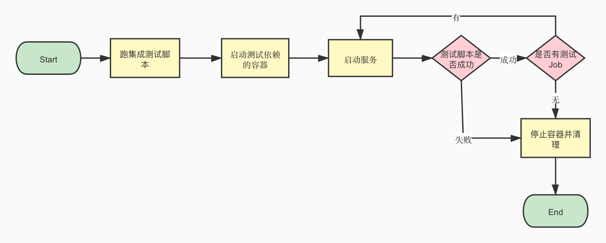

> > 本文主要从dubbo-go-sample为demo分析集成测试的作用

# **概览**

为了保障一个系统的稳定需要引入多种测试方式，测试又跟随场景对象和思路可以分为黑盒测试，白盒测试，性能测试，单元测试，集成测试等等。本文主要讨论集成测试的相关概念。

**集成测试**又称**组装测试**，即对程序模块采用一次性或增值方式组装起来，对系统的接口进行正确性检验的测试工作。整合测试一般在单元测试之后、系统测试之前进行。实践表明，有时模块虽然可以单独工作，但是并不能保证组装起来也可以同时工作。

# **测试流程**

在`dubbo-go-sample`这个repo中，整个集成测试的流程是通过脚本去启动docker容器，然后启动不同sample对应的server，在通过跑integrate_test中的测试代码来检验这个sample的测试用例是否有问题，如果没有问题，所有的TEST会是PASS状态，否则对应的TEST会处于失败的状态并且退出测试，脚本会停止并清空所有的容器。为了方便理解，流程如下：

[](../../img/blog/dubbo-go-samples-action-集成测试.resources/test_flow.jpg)

集成测试流程图

# **项目结构**

## **dubbo-go-sample的目录结构**

本段主要讨论各个目录的功能，以及开发者如何在添加对应的测试代码。`dubbo-go-sample`的树结构如下

```
.
├── ...
├── helloworld
├── integrate_test
├── ...
└── tracing

```

**integrate_test** 存放了sample的测试代码，**其他目录**存放的是server的代码，下面笔者会按照helloworld项目为例子去讲解，所以其他sample被`...`给替换了。

## **integrate_test的目录结构**

如下是**integrate_test**的目录结构，其中需要启动容器都会配置在**dockercompose**中，避免每次启动服务都需要重新启动容器的问题，其他的目录都存放了不同项目的测试代码

```
.
├──  ...
├── dockercompose
├── helloworld
├── ...
└── rpc
```

## **helloworld的目录结构**

与**integrate_test**同目录下面的**helloworld**的目录结构如下，其中需要用到的是**go-server**中的代码，集成测试的脚本会找到**go-server**里面的服务代码并且启动他。

```
.
├── go-client
├── go-server
├── java-client
└── java-server

```

# **如何添加一个测试**

基于上面章节的讲解，集成测试主要是从**integrate_test**找测试代码，从**integrate_test**的同级目录下面找server去启动，所以要写一个测试需要增加一个server，增加一份测试代码和在测试脚本里面增加需要测试的sample代码。所以我下面会详细讲解path的注意点。

integrate_test.sh 主要会从固定的path下面去找配置和代码，下文会以helloworld为demo分别会从server，test和config三个部分去讲解需要添加的元素。

## **Sample Server**

开发者需要关注helloworld目录的下级目录是否有**go-server**，如果有这个目录，集成测试的脚本会从**go-server**这个目录下面找**cmd**和**conf**，**cmd**是存放server代码的目录，**conf**是存放dubbogo.yml这个文件的地方。

```
.
├── go-client
│   ├── cmd
│   └── conf
├── go-server
│   ├── cmd
│       └── your server code
│   ├── conf
│       └── dubbogo.yml
│   └── dist
```

## **Sample Test**

在**integrate_test**这个目录下面需要与Server的名字一致，比如上面的Server是helloworld，那么这个test的目录也是helloworld，在helloworld这个目录下面需要添加一个tests/integration这个路径去存放对应的测试代码，docker目录下面存放的是docker容器的探活脚本。

```
.
├── docker
└── tests
    └── integration
       └── your test code
```

## **Sample Config**

为了减少冗余配置，需要优先启动的容器建议存放在**dockercompose**这个目录下面的`docker-compose.yml`这个文件当中，脚本会启动配置文件的服务来帮助集成测试的进行。

```
├── dockercompose
       └── docker-compose.yml // please add your service config
```

# 优化点

在流程图中，没有完全能保证server启动的机制，如果server没启动，client启动的话，则整个集成测试就会FAIL。

集成测试的入口换成shell脚本，这样可以解耦不同语言，脚本侧只需要关心是否有shell文件即可。

# 引用

[https://zh.wikipedia.org/wiki/集成测试](https://zh.wikipedia.org/wiki/%E9%9B%86%E6%88%90%E6%B5%8B%E8%AF%95)