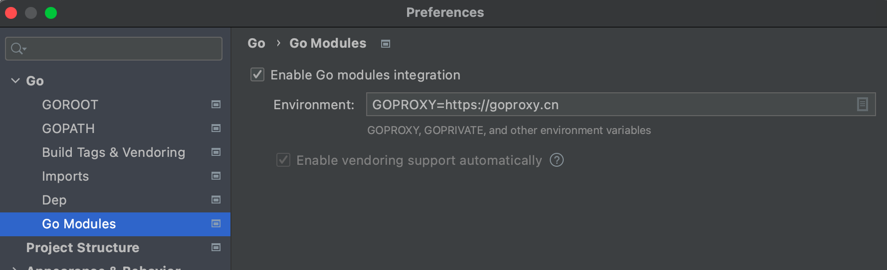

# Dubbogo 3.0 快速开始

## 1. 环境安装

### 1.1 安装Go语言环境

建议使用最新版 go 1.17

go version >= go 1.13

[【Go 语言官网下载地址】](https://golang.google.cn/)

将 $GOPATH/bin 加入环境变量

### 1.2 安装序列化工具protoc

[【protoc 下载地址】](https://github.com/protocolbuffers/protobuf/releases)

### 1.3 安装 protoc-gen-go, proto-gen-go-triple 编译插件

 ```shell
export GO111MODULE="on"
export GOPROXY="https://goproxy.cn"
go install github.com/golang/protobuf/protoc-gen-go@latest 
go install github.com/dubbogo/tools/cmd/protoc-gen-go-triple@latest
 ```

确保上述protoc 和安装的 protoc-gen-go-triple 位于$(GOPATH)/bin, 在系统环境变量内

```bash
$ protoc --version
libprotoc 3.14.0
$ protoc-gen-go --version
protoc-gen-go: unknown argument "--version" (this program should be run by protoc, not directly)
$ protoc-gen-go-triple --version
protoc-gen-go-triple 1.0.0
```

### 1.4 启动zookeeper

选择您喜欢的方式启动zk，如您安装docker-compose可直接从文件启动: 

zookeeper.yml:

```yaml
version: '3'
services:
  zookeeper:
    image: zookeeper
    ports:
      - 2181:2181
    restart: on-failure
```

```shell
docker-compose -f ./zookeeper.yml up -d
```

## 2. 编译接口

### 2.1 编写接口描述文件 helloworld.proto

```protobuf
syntax = "proto3";

option go_package="./;api"; // 必须填写，这里的意义为：生成代码在./（当前目录） 使用'api'作为package名

// The greeting service definition.
service Greeter {
  rpc SayHello (HelloRequest) returns (User) {}
  rpc SayHelloStream (stream HelloRequest) returns (stream User) {}
}

// The request message
message HelloRequest {
  string name = 1;
}

// The response message
message User {
  string name = 1;
  string id = 2;
  int32 age = 3;
}
```

### 2.2 使用安装好的编译工具编译接

参数意义：`--go_out=.` 使用上述安装的 `protoc-gen-go` 插件，生成文件到当前目录，`--go-triple_out=.`使用上述安装的 `protoc-gen-go-triple` 插件，生成文件到当前目录。

```bash
protoc --go_out=. --go-triple_out=. ./helloworld.proto
```

执行该指令后，会生成两个文件，分别是helloworld.pb (包含 proto 结构) 和 helloworld_triple.pb.go (包含 triple 协议接口)。

代码生成和使用方式与 grpc 类似。

## 3. 开启一次RPC调用

建立如下文件目录：

```text
quickstart
├── api
│   ├── helloworld.pb.go
│   ├── helloworld.proto
│   └── helloworld_triple.pb.go
├── client
│   └── client.go
└── server
    └── server.go

```

client.go文件：

```go
package main

import (
	"context"
)

import (
	"dubbo.apache.org/dubbo-go/v3/common/logger"
	"dubbo.apache.org/dubbo-go/v3/config"
	_ "dubbo.apache.org/dubbo-go/v3/imports"
)

import (
	"dubbo3-demo/api"
)

var greeterProvider = &api.GreeterClientImpl{}


func init() {
	config.SetConsumerService(greeterProvider)
}

func main() {
	// init rootConfig with config api
	rc := config.NewRootConfigBuilder().
		SetConsumer(config.NewConsumerConfigBuilder().
			SetRegistryIDs("zookeeper").
			AddReference("GreeterClientImpl", config.NewReferenceConfigBuilder().
				SetInterface("org.apache.dubbo.UserProvider").
				SetProtocol("tri").
				Build()).
			Build()).
		AddRegistry("zookeeper", config.NewRegistryConfigWithProtocolDefaultPort("zookeeper")).
		Build()

	// validate consumer greeterProvider
	if err := rc.Init(); err != nil{
		panic(err)
	}

	// run rpc invocation
	testSayHello()
}

func testSayHello() {
	ctx := context.Background()

	req := api.HelloRequest{
		Name: "laurence",
	}
	user, err := greeterProvider.SayHello(ctx, &req)
	if err != nil {
		panic(err)
	}

	logger.Infof("Receive user = %+v\n", user)
}
```

server.go文件：

```go
package main

import (
	"context"
)

import (
	"dubbo.apache.org/dubbo-go/v3/common/logger"
	"dubbo.apache.org/dubbo-go/v3/config"
	_ "dubbo.apache.org/dubbo-go/v3/imports"
)

import (
	"dubbo3-demo/api"
)

func main() {
	config.SetProviderService(&GreeterProvider{})

	rc := config.NewRootConfigBuilder().
		SetProvider(config.NewProviderConfigBuilder().
			AddService("GreeterProvider", config.NewServiceConfigBuilder().
				SetInterface("org.apache.dubbo.UserProvider").
				SetProtocolIDs("tripleProtocolKey").
				Build()).
			SetRegistryIDs("registryKey").
			Build()).
		AddProtocol("tripleProtocolKey", config.NewProtocolConfigBuilder().
			SetName("tri").
			Build()).
		AddRegistry("registryKey", config.NewRegistryConfigWithProtocolDefaultPort("zookeeper")).
		Build()

	if err := rc.Init(); err != nil{
		panic(err)
	}

	select {}
}

type GreeterProvider struct {
	api.UnimplementedGreeterServer
}

func (s *GreeterProvider) SayHelloStream(svr api.Greeter_SayHelloStreamServer) error {
	c, err := svr.Recv()
	if err != nil {
		return err
	}
	logger.Infof("Dubbo-go3 GreeterProvider recv 1 user, name = %s\n", c.Name)
	c2, err := svr.Recv()
	if err != nil {
		return err
	}
	logger.Infof("Dubbo-go3 GreeterProvider recv 2 user, name = %s\n", c2.Name)
	c3, err := svr.Recv()
	if err != nil {
		return err
	}
	logger.Infof("Dubbo-go3 GreeterProvider recv 3 user, name = %s\n", c3.Name)

	svr.Send(&api.User{
		Name: "hello " + c.Name,
		Age:  18,
		Id:   "123456789",
	})
	svr.Send(&api.User{
		Name: "hello " + c2.Name,
		Age:  19,
		Id:   "123456789",
	})
	return nil
}

func (s *GreeterProvider) SayHello(ctx context.Context, in *api.HelloRequest) (*api.User, error) {
	logger.Infof("Dubbo3 GreeterProvider get user name = %s\n", in.Name)
	return &api.User{Name: "Hello " + in.Name, Id: "12345", Age: 21}, nil
}
```

quickstart 目录下，执行 `go mod init dubbo3-demo`

如果弹出 go mod detected 弹窗，需要勾选 Enable Go modules integration ，设置GOPROXY，保证 Goland 可以正确拉取到依赖，方便开发。或者在设置中按照如下位置设置。



命令行执行 `export GOPROXY="https://goproxy.cn" `设置PROXY

执行`go mod tidy`

最终文件目录：

```text
quickstart
├── api
│   ├── helloworld.pb.go
│   ├── helloworld.proto
│   └── helloworld_triple.pb.go
├── client
│   └── client.go
├── go.mod
├── go.sum
└── server
    └── server.go
```

先后启动服务端和客户端（在 server 和 client 文件夹下分别执行 `go run .`) , 可在客户端看到输出：

```
 Receive user = {Name:Hello laurence Id:12345 Age:21 ...}
```

获得调用结果成功

## 4. 更多

细心的读者可以发现，以上例子编写的的服务端可以接受来自客户端的普通RPC、流式RPC调用请求。目前只编写了普通调用的Client，读者可以根据samples库中的例子来尝试编写流式客户端发起调用。

更多samples可以参阅 [【dubbo-go-samples】](../../samples/samples.html)

下一章：[【Dubbogo 基本概念】](../../concept/app_and_interface.html)
